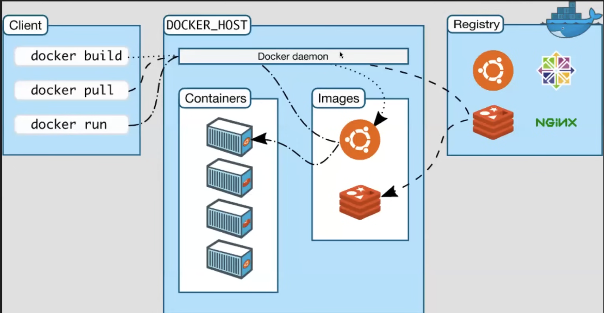
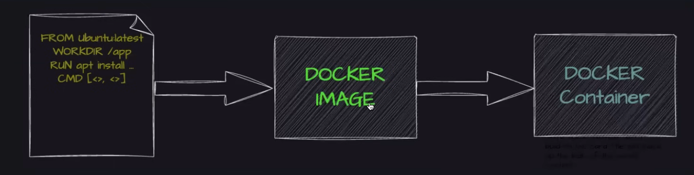

# Docker
This repository contains common commands and important information related to docker.

## Some basic information on what docker is used for:

With docker, you can run each component of an application (webserver, database, messaging, orchestration) in a separate container with its own dependencies and its own libraries all on the same virtual machine and operating system but; within the separate environment or containers. We just have to build docker configuration once and developers can get started simply by running `docker run` command irrespective of what operating system they use. They just need docker installed on their system.

The main purpose of docker is to package and containerize apps, and to ship them, and to run them anytime, anywhere and as many times as you want.

Virtual Machines have solved some problems with physical servers and Containers have solved some problems with Virtual Machines.

### Docker Lifecycle:

### Docker terminologies
* Docker Daemon:
  - Heart of docker
  - Like a service in linux
  - Listens to docker API requests and acts upon the requests

* Docker Client:
  - Docker CLI

* Docker Desktop:

* Docker Registries:
  - Stores docker images
  - Docker hub is a public registry that anyone can use and by default docker is configured to use this registry to pull its images from
   - A platform that you use to share your container images

* Dockerfile:
  - A file where you provide steps to build your Docker Image by the help of docker daemon

* Images:
  - Images built using dockerfile that can be used to run applications

### Difference between GitHub & Docker Hub?
  - GitHub is a version control system to store your source code whereas docker hub stores your docker images

### References
https://udemy.com/course/learn-docker
https://github.com/iam-veeramalla/Docker-Zero-to-Hero
